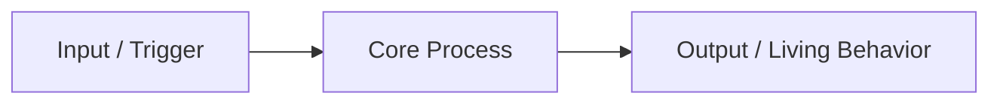

# Page Title

**At a glance**

- **Purpose**: One sentence.
- **Audience**: Who should read this.
- **Boundary**: What this document covers and explicitly does not cover.
- **Main rule**: The single most important rule readers should remember.

## Purpose

2–4 sentences explaining why this document exists and how it fits into the larger knowledge base.

## Simple Concepts

**Term 1**: Short definition.

**Term 2**: Short definition.

## Main Content

Use clear headings.

Ground every claim in code, tests, OpenAPI, or configuration.

Link to related canonical documents using relative Markdown links.

### Subsection

Details here.

## Known Limitations & Recommendations

- Bullet list of current gaps or trade-offs.
- Recommendations for future improvements.

## Related Documents

- `docs/guides/related-topic.md` — why it is related
- `docs/architecture/relevant-subsystem.md`

## Sources

- `path/to/implementing/code.js` — implements X behavior
- `docs/adr/00XX-title.md` — records the decision to do Y

---

*Last updated*: YYYY-MM-DD (update on every meaningful change)
*Canonical owner*: This file (or note if ownership is shared)

**Template notes**:
- Always start new living docs with the "At a glance" section + one primary Mermaid diagram when the topic benefits from it.
- Keep prose plain, specific, and scannable.
- Update the date and ensure the file is listed/updated in `docs/README.md`.