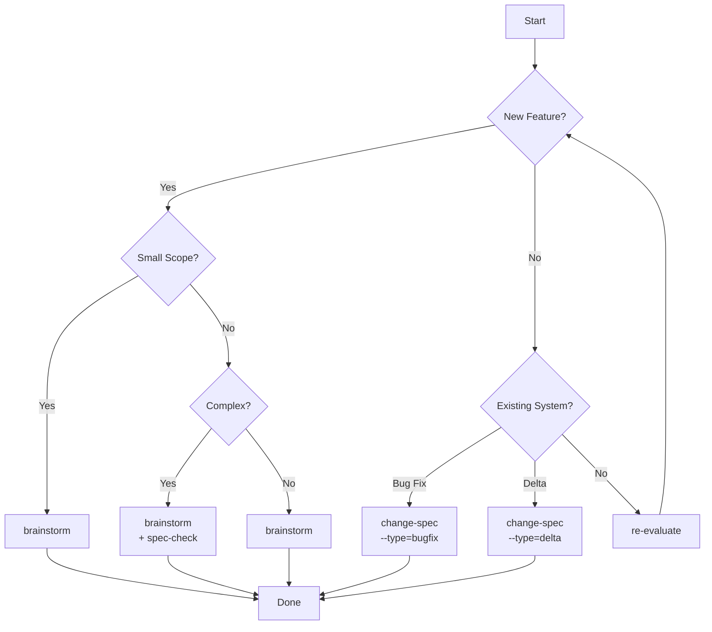

# Decision Tree - Choosing the Right Specification Document

Quick decision guide for selecting the appropriate specification workflow based on your context.

## Quick Decision Flow

```
Is this a NEW feature from scratch?
│
├─ YES → Is scope SMALL (simple change, well-understood)?
│         ├─ YES → Use /specs:brainstorm
│         └─ NO  → Is complexity HIGH (>10 files, multiple domains)?
│                   ├─ YES → Use /specs:brainstorm + /specs:spec-check
│                   └─ NO  → Use /specs:brainstorm
│
└─ NO  → Is this a BUG FIX?
          ├─ YES → Use /specs:change-spec --type=bugfix
          └─ NO  → Is this a DELTA (modify existing behavior)?
                    ├─ YES → Use /specs:change-spec --type=delta
                    └─ NO  → Use /specs:brainstorm (re-evaluate scope)
```

---

## Detailed Decision Matrix

| Scenario | Solo Developer | Small Team (2-5) | Long-Term Project | Enterprise |
|----------|----------------|------------------|-------------------|------------|
| **Bug Fix** | change-spec (bugfix) | change-spec (bugfix) | change-spec (bugfix) | change-spec (bugfix) |
| **Small Change** | brainstorm | brainstorm | change-spec (delta) | change-spec (delta) |
| **New Feature (simple)** | brainstorm | brainstorm | brainstorm + spec-check | brainstorm + spec-check |
| **New Feature (complex)** | brainstorm + spec-check | brainstorm + spec-check | brainstorm + spec-check | brainstorm + spec-check |
| **Modify Existing** | change-spec (delta) | change-spec (delta) | change-spec (delta) | change-spec (delta) |
| **Greenfield Project** | brainstorm | brainstorm | brainstorm + spec-check | brainstorm + spec-check + review |

---

## Complexity Scoring - Scope Score

Calculate your scope score to determine documentation depth:

### Scoring Dimensions (0-5 each)

| Dimension | 0 | 1 | 2 | 3 | 4 | 5 |
|-----------|---|---|---|---|---|---|
| **User Stories** | 1 | 2-3 | 4-5 | 6-7 | 8-9 | 10+ |
| **Functional Domains** | 1 | 2 | Single | Multiple | Many | All |
| **Integration Points** | 0 | 1 | 2 | 3-4 | 5-6 | 7+ |
| **Data Entities** | 1-2 | 3-4 | 5-6 | 7-8 | 9-10 | 11+ |
| **User Flows** | 1 | 2 | 3 | 4-5 | 6-7 | 8+ |
| **Edge Cases** | 0-1 | 2-3 | 4-5 | 6-7 | 8-9 | 10+ |

### Score Interpretation

| Total Score | Classification | Recommended Doc |
|-------------|----------------|-----------------|
| 0-8 | Simple | brainstorm |
| 9-15 | Moderate | brainstorm |
| 16-24 | Complex | brainstorm + spec-check |
| 25-30 | Very Complex | brainstorm + spec-check + review |

---

## Flow Diagram (Mermaid)



---

## Command Quick Reference

| Command | When to Use | Output |
|---------|-------------|--------|
| `/specs:brainstorm [idea]` | New feature, any scope | `docs/specs/[id]/YYYY-MM-DD--name.md` |
| `/specs:change-spec --type=delta --title="..."` | Modify existing system | `docs/specs/[id]/changes/...md` |
| `/specs:change-spec --type=bugfix --title="..."` | Document bug fix | `docs/specs/[id]/changes/...md` |
| `/specs:spec-check [spec-folder]` | Resolve markers, check quality | Updated spec file |

---

## Anti-Patterns (4 Examples)

### 1. Using Brainstorm for Bug Fixes

**Wrong:** Running `/specs:brainstorm` to document "Fix login timeout bug"

**Why:** Brainstorm is for new features. Bug fixes need change-spec with root cause analysis and unchanged behavior documentation.

**Correct:** `/specs:change-spec --type=bugfix --title="Fix login timeout"`

---

### 2. Skipping spec-check on Complex Specs

**Wrong:** Completing brainstorm and moving directly to spec-to-tasks on a 25+ point scope

**Why:** Complex specs often have [NEEDS CLARIFICATION] markers that cause implementation blockers.

**Correct:** `/specs:brainstorm` → `/specs:spec-check` → `/specs:spec-to-tasks`

---

### 3. Using brainstorm for Well-Understood Features Without Proper Assessment

**Wrong:** Using `/specs:brainstorm` without considering if scope needs reassessment

**Why:** All features, simple or complex, should start with brainstorm for consistent documentation.

**Correct:** `/specs:brainstorm` → scope assessment → split if needed

---

### 4. Delta Without Affected Components

**Wrong:** Creating change-spec without listing affected components or risk assessment

**Why:** Without impact analysis, team members don't know what's at risk. Leads to unexpected regressions.

**Correct:** Always fill "Affected Components" table and "Risk Assessment" section in delta specs.

---

## Summary Table: Team vs Scenario

| Team Size | Bug Fix | Small Change | New Feature | Modify Existing | Greenfield |
|-----------|---------|--------------|-------------|-----------------|------------|
| **Solo** | change-spec | brainstorm | brainstorm | change-spec | brainstorm |
| **2-5** | change-spec | brainstorm | brainstorm | change-spec | brainstorm + spec-check |
| **5-10** | change-spec | brainstorm | brainstorm | change-spec | brainstorm + spec-check |
| **Enterprise** | change-spec | change-spec | brainstorm + spec-check | change-spec | brainstorm + spec-check + review |

---

## Quick Selection Guide

```
┌─────────────────────────────────────────────────────────────┐
│                    DECISION TREE                             │
├─────────────────────────────────────────────────────────────┤
│  1. NEW feature? → YES → Use brainstorm                     │
│                                                             │
│     └─ NO → Bug fix? → YES → change-spec --type=bugfix      │
│                    └─ NO → Delta? → YES → change-spec delta │
│                                      └─ NO → re-evaluate    │
└─────────────────────────────────────────────────────────────┘
```

**Remember:**
- When in doubt, prefer brainstorm for consistent documentation
- Complex specs can always be split into multiple focused specs
- Always run `spec-check` on specs with [NEEDS CLARIFICATION] markers
- Use `change-spec` for modifications, never modify original spec directly